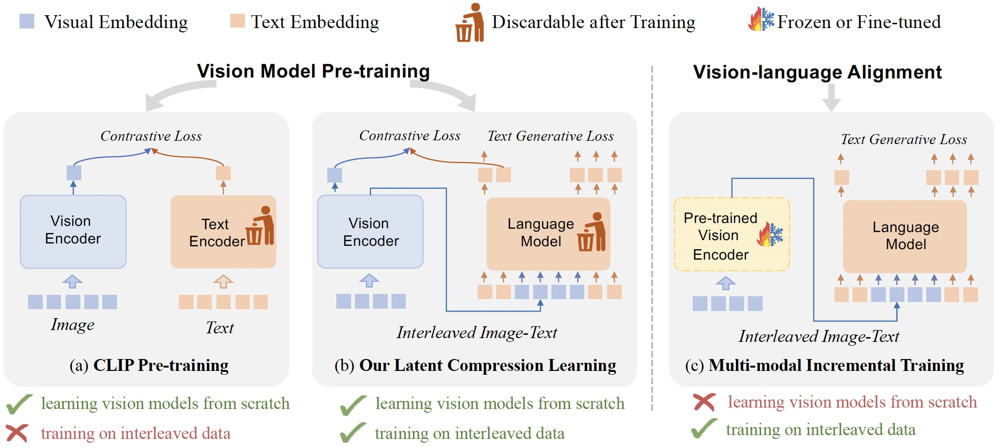
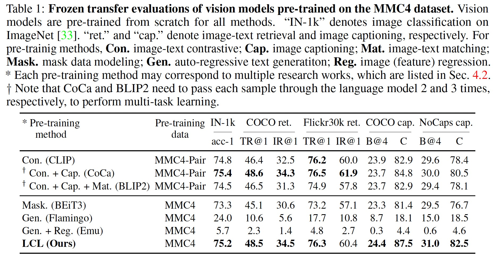
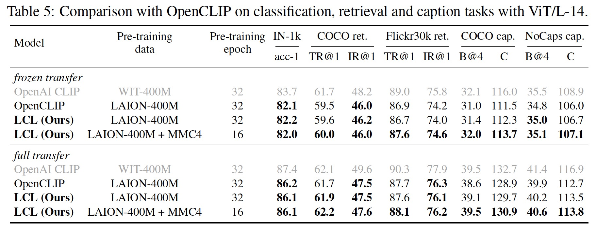
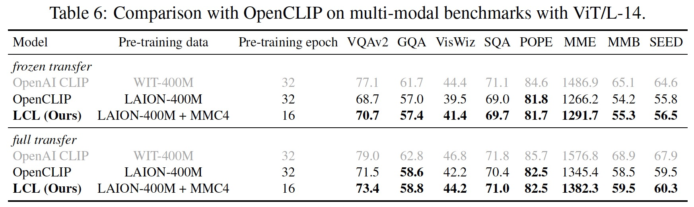

# Latent Compression Learning (LCL)

The official implementation of the paper "Vision Model Pre-training on Interleaved Image-Text Data via Latent Compression Learning".

We introduce the Latent Compression Learning (LCL) to pre-train vision models from scratch with interleaved image-text data. Compared to existing methods (e.g., CLIP, auto-regressive text generation), our proposed LCL is the first to achieve both

* Learning vision models from scratch
* Training on interleaved image-text data



## 📈 Results

### Pre-training on MMC4 Dataset



Our LCL pre-training significantly outperforms all other methods in the caption tasks and is on par with the best paired pre-training methods on classification and retrieval tasks.

### Comparison with OpenCLIP





When both using LAION-400M data, our LCL pre-training achieves similar performance to OpenCLIP. When combined with MMC4 data, our LCL pre-training outperforms OpenCLIP, especially in caption and multi-modal dialogue tasks. For a fair comparison, the total number of images seen during pre-training is 13B.


## 🛠️ Usage

### Install

This code is built upon [OpenCLIP](https://github.com/mlfoundations/open_clip), you can refer to their repository for setup.

### Training LCL

The example training scripts are provided in [`./scripts`](./scripts). You can refer to [OpenCLIP](https://github.com/mlfoundations/open_clip?tab=readme-ov-file#training-clip) for more ways to launch training.

**Training on LAION-400M:** Run [`./scripts/lcl_vit_b_32_laion.sh`](./scripts/lcl_vit_b_32_laion.sh). The corresponding model config is [here](./src/open_clip/model_configs/LCL_ViT-B-32_laion.json).

**Training on MMC4:** TODO, will be completed before 2024/6/15.

## Pre-trained Checkpoints

The following are the checkpoints of our pre-trained vision encoders. (Some of the checkpoints will be available in the future based on the schedule)

| model | data | epoch | download |
| :---: | :---: | :---: | :---: |
| ViT-B/32 | LAION-400M | 32 | eta: 2024/06/15 |
| ViT-B/32 | LAION-400M + MMC4 | 32 | TBD |
| ViT-B/32 | LAION-2B + CC-Interleaved | 15 | eta: 2024/06/25 |
| ViT-L/14 | LAION-400M | 32 | TBD |
| ViT-L/14 | LAION-400M + MMC4 | 32 | TBD |
| ViT-L/14 | LAION-2B + CC-Interleaved | 15 | TBD |

**CC-Interleaved is a newly collected interleaved image-text dataset with over one billion images, which will be released soon.**

**NOTE:** We conduct large-scale pre-training with internal efficient code, which will not be released due to intellectual property reasons. This released version has been verified and can reproduce the results of ViT-B/32 on LAION-400M dataset.


## 📅 Schedule

* [X]  basic code of LCL
* [ ]  checkpoints of more models and datasets
* [ ]  transfer evaluation code

## 🖊️ Citation

If you find this work helpful in your research, please consider citing:

```bibtex
@article{yang2024vision,
  title={Vision Model Pre-training on Interleaved Image-Text Data via Latent Compression Learning},
  author={Yang, Chenyu and Zhu, Xizhou and Zhu, Jinguo and Su, Weijie and Wang, Junjie and Dong, Xuan and Wang, Wenhai and Li, Bin and Zhou, Jie and Qiao, Yu and Dai, Jifeng},
  year={2024}
}
```

## 📃 License

This project is released under the [MIT license](LICENSE). Parts of this project contain code and models from other sources, which are subject to their respective licenses.

## 🙏 Acknowledgements

Our code is built with reference to the code of the following projects: [OpenCLIP](https://github.com/mlfoundations/open_clip).
